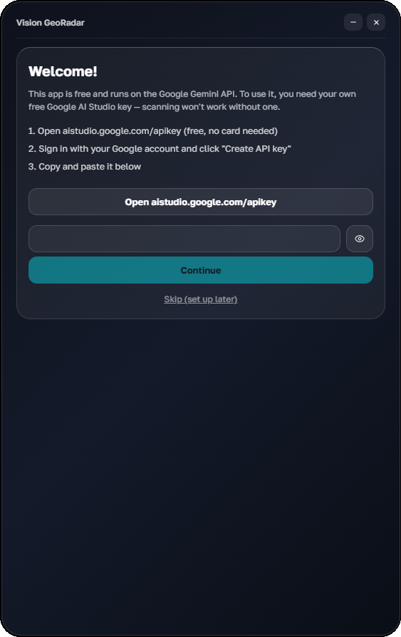
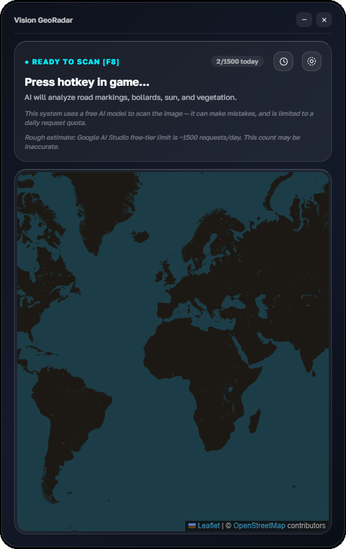
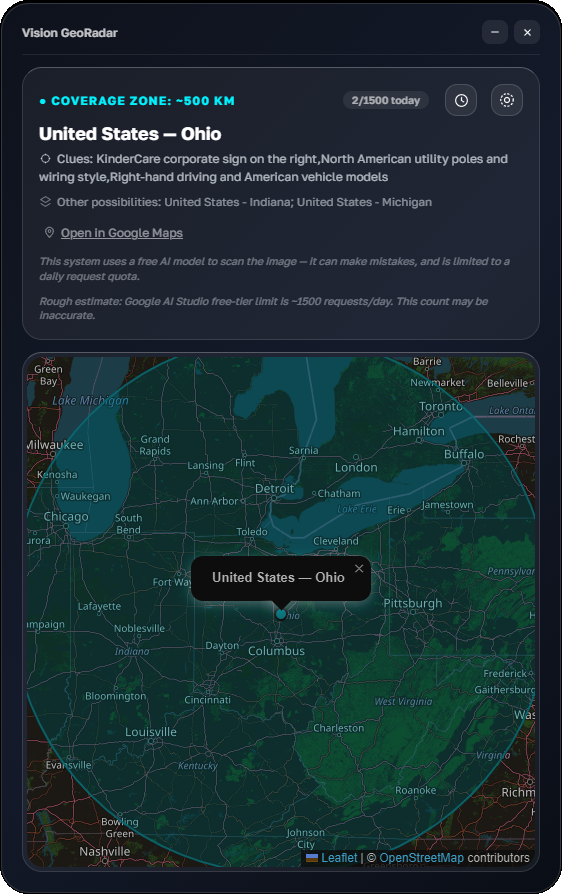
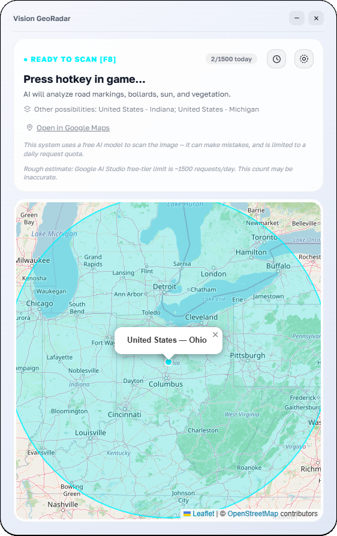
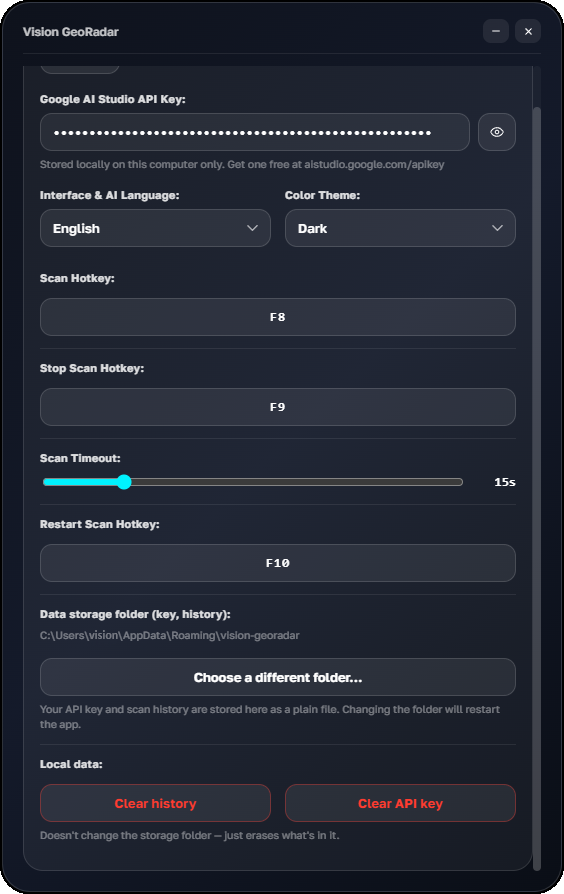

# Vision GeoRadar

An unofficial, standalone Electron helper for location-guessing games like GeoGuessr (not affiliated with GeoGuessr AB — see the disclosures below): global hotkey → screenshot → AI analysis via the Google Gemini API → shows the predicted location on a map. Each user brings their own free Google AI Studio API key (BYOK) — the app walks you through getting one on first launch.

## Screenshots

<table>
<tr>
<td width="33%"><br><sub>First launch — paste your free API key</sub></td>
<td width="33%"><br><sub>Ready to scan — press the hotkey in-game</sub></td>
<td width="33%"><br><sub>Result — country, clues, and a zoomed map</sub></td>
</tr>
<tr>
<td width="33%"><br><sub>Light theme</sub></td>
<td width="33%"><br><sub>Settings — hotkeys, storage folder, data controls</sub></td>
<td width="33%"></td>
</tr>
</table>

## Running in development mode

```bash
npm install
npm start
```

Your Google AI Studio key is entered right in the app's UI on first launch (the welcome screen) or later in Settings — it's stored locally on your machine and never committed to the repository.

How to get a key (free, 2 minutes, no credit card):
1. Open [aistudio.google.com/apikey](https://aistudio.google.com/apikey)
2. Sign in with any Google account
3. Click "Create API key" → copy it
4. Paste it into the app on the welcome screen (or later in Settings)

For development, you can temporarily override it with the `GOOGLE_API_KEY` environment variable — it takes priority over whatever is saved in Settings.

## Building a standalone `.exe` with a shortcut

```bash
npm run dist
```

`electron-builder` produces two Windows builds in the `dist/` folder:
- **`Vision GeoRadar-X.Y.Z-Setup.exe`** — a regular installer (NSIS): installs the app, creates a desktop/Start Menu shortcut, and supports auto-update (see below).
- **`Vision GeoRadar-X.Y.Z-Portable.exe`** — a portable build: download and run, no installation, no shortcuts, no admin rights needed. This version can't auto-update (there's no installer to swap files underneath it) — to get a new version, users just re-download it manually.

Users pick whichever file they want from the release page.

The app ships with its own icon (`assets/icons/icon.ico` for Windows, `assets/icons/icon.png` for macOS/Linux) — no extra setup needed. Want to swap it for your own? Replace those two files and re-run `npm run dist`.

### How to cut a GitHub release (so auto-update actually works)

Auto-update (`electron-updater`) only works for the **NSIS-installed** version, and only if a real GitHub release with the right files exists. Simply having `build.publish.owner/repo` in `package.json` doesn't publish anything by itself — it's just the address where `electron-updater` will look for updates.

**Option A — manual (simpler to start with, no tokens needed):**
1. Bump the version in `package.json` (the `"version"` field), e.g. `1.0.0` → `1.0.1`.
2. Build: `npm run dist`.
3. On GitHub, go to **Releases → Draft a new release**, create a tag like `v1.0.1` (the leading `v` matters — that's how `electron-builder`/`electron-updater` parse the version).
4. Attach **all** the relevant files from `dist/` to the release — both `.exe` files (Setup and Portable) **and, critically, `latest.yml`** (without it `electron-updater` has no way to know a new version exists — this file is not optional).
5. Publish the release (Publish, not Draft).

**Option B — one command (faster if you'll be releasing often):**
1. Create a GitHub Personal Access Token with `repo` scope (Settings → Developer settings → Personal access tokens).
2. Locally: `set GH_TOKEN=your_token` (Windows) or `export GH_TOKEN=your_token` (macOS/Linux).
3. `npm run dist -- --publish always` — builds and immediately creates the GitHub release with everything needed, including `latest.yml`.

To confirm auto-update is actually working: install the app from `Setup.exe`, then publish a slightly newer version using either method above — on next launch the app should silently download the update and show a banner offering to restart.

## Architecture

- UI — a single SPA page (HTML/CSS/JS), no cross-process bridging for rendering.
- Map — Leaflet, bundled fully locally (`assets/leaflet/`); map tiles are fetched from OpenStreetMap over the network.
- Font — Golos Text (bundled locally, `assets/fonts/`), supports both Cyrillic and Latin scripts.
- AI — the Google Gemini API directly, with no third-party intermediary. Model list: `gemini-flash-latest` / `gemini-flash-lite-latest` (floating aliases that Google itself points at its current recommended model) with pinned versions `gemini-3.6-flash` / `gemini-3.5-flash-lite` as a fallback. Every user gets their own free quota tied to their own key — not a shared pool split across everyone, as is common with free-model aggregators. Google updates its model lineup frequently — check [ai.google.dev/gemini-api/docs/models](https://ai.google.dev/gemini-api/docs/models) for the current list.
- Settings — `electron-store`, stored in a system config folder (see "Data privacy" below — this folder is user-configurable).
- 8 UI languages, two themes (Dark / Light), with automatic detection of the system language/theme on first launch.

## Known limitations

1. **Global hotkeys and exclusive fullscreen games**: if a game isn't running in windowed/borderless fullscreen mode, the OS sometimes won't deliver global hotkeys to background applications — this is an OS/DirectX limitation, not an Electron one.
2. **Screen capture on macOS** requires granting "Screen Recording" permission in System Settings on first use.
3. Google AI Studio's free tier is limited (roughly ~1,500 requests/day on the flash models as of this writing; exact numbers and terms can change — see [ai.google.dev/pricing](https://ai.google.dev/pricing)). The limit applies per-key, individually to each user.

---

## Legal aspects and disclosures

The section below is not legal advice — it's an honest description of how the app works, so users and contributors know what they're agreeing to.

### License

The project's code is distributed under the MIT License (see `LICENSE`) — free to use, copy, and modify, including for commercial purposes, with no warranty of any kind ("as is").

### Application security

- Electron is configured per current best practices: `contextIsolation: true`, `nodeIntegration: false` — the renderer process (the part that draws the UI) has no direct access to Node.js or the filesystem; all communication with system APIs goes through an explicitly defined `preload.js`.
- `index.html` sets a `Content-Security-Policy` that blocks inline script execution and disallows loading anything except the app's own local files and map tiles from `tile.openstreetmap.org`.
- Any text the AI model itself returns (clues, alternative guesses, country/region names) is always inserted as a plain text node (`textContent`/`createTextNode`), never via `innerHTML` — so a model response can never be interpreted as HTML/JS, even if it happens to contain something that looks like markup.

### Third-party components

The full list of libraries, fonts, and their licenses is in `THIRD_PARTY_NOTICES.md`. In short: every dependency (Electron, Leaflet, the Golos Text font, npm packages) is under a permissive license (MIT/BSD/Apache-2.0/OFL), which places no extra restrictions on this project — but their license texts must be preserved when redistributing, which has been done.

### Data privacy

The app takes a screenshot **only when you press the scan hotkey** and sends that image to a third-party AI provider (the Google Gemini API) for analysis. The screenshot is never saved to disk and never sent anywhere except that one analysis request. That said:
- Don't trigger a scan while something private might be on screen (personal chats, passwords, documents) — the screenshot captures your entire primary monitor.
- Processing happens on Google's servers — using the Gemini API is subject to [Google's own privacy terms](https://ai.google.dev/gemini-api/terms), not ours. On the free tier, Google may use submitted data to improve its models — see the linked terms for details.
- Settings (hotkeys, language, theme, **API key**, and a history of your last 10 scans — country/region/coordinates/timestamp) are stored locally on your machine via `electron-store`, as a **plain, unencrypted JSON file** (this is the library's standard behavior; no encryption is applied). By default that file lives in the app's system config folder (`%APPDATA%/vision-georadar` on Windows, `~/Library/Application Support/vision-georadar` on macOS, `~/.config/vision-georadar` on Linux) and never leaves your machine on its own — but anyone with access to that OS account (or to a backup of that folder) could read both your key and your scan history in plain text.
- **The storage folder is configurable.** In Settings → "Data storage folder", you can point the app at a different directory (for example, an encrypted drive or a folder excluded from cloud backups). Changing it copies your existing settings/key/history into the new location and restarts the app. A small pointer file recording which folder you chose always stays in the default system config folder so the app knows where to look on next launch — that pointer file itself contains no key or history data, only a path.
- **You can wipe your local data on demand.** Settings → "Local Data" has two buttons: "Clear history" (deletes all saved past scans) and "Clear API key" (deletes the saved key, so you'd need to re-enter it). Both ask for confirmation first and take effect immediately, without needing to touch the storage folder itself.

### Fair use in location-guessing games — important

This app is a general-purpose photo-location assistant, commonly used with online location-guessing games like GeoGuessr. **It is an unofficial, independent tool and is not affiliated with, endorsed by, or sponsored by GeoGuessr AB or any other game publisher** — mentioned here purely to describe what the app is compatible with. That said, many such games treat third-party AI assistance as a violation of fair play, especially in ranked or competitive modes, and actively ban accounts found using tools like this one. Responsibility for whether and how this app is used within any particular game's rules rests entirely with the user — check that game's own Terms of Service before using it there, and consider sticking to private/practice matches where outside help isn't explicitly prohibited.

### Disclaimer

AI analysis can be wrong (the UI includes a corresponding disclaimer). The authors are not responsible for:
- the accuracy of analysis results,
- account bans on third-party platforms resulting from using this app,
- any costs incurred from using paid Google AI Studio features (the app uses the free tier exclusively by default).

### Before making your repository public — please check this

If a real API key was ever committed at some point during development (even if it was later removed from the latest commit), **it's still recoverable from the repository's git history** once that history is public on GitHub. Before making the repo public:
1. Revoke/reissue any Google AI Studio key that has ever appeared in the code, even briefly.
2. Either start the git history fresh (`rm -rf .git && git init`) before your first public push, or scrub the history with `git filter-repo` / the BFG Repo-Cleaner if it already contains sensitive commits you don't want to lose entirely.
3. `package.json`'s `build.publish` section already has `owner`/`repo` filled in — update them here if the repository is ever renamed or moved to a different account.
4. Verified: at the time this was prepared for publication, no real keys were found in the code or git history — but that check doesn't replace running your own `git log -p | grep -i key`.
